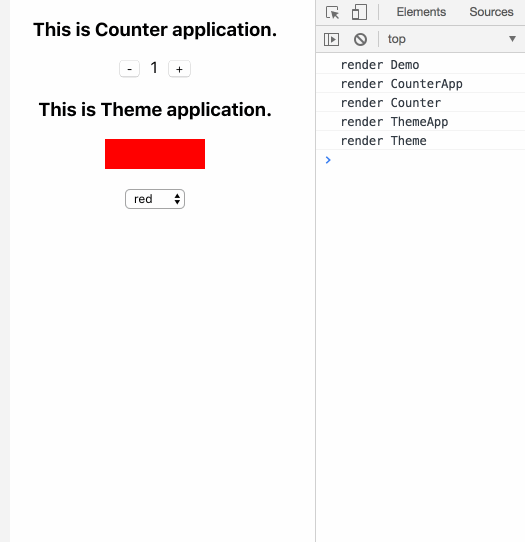

# react-new-context-hoc

This is a library offering an idea to resolve the state management problem.

## 1. Introduction

Though such as redux, mobx libraries have been popularly used in many projects to manager app state, there are still some problems existed. And if you don't want to use these libraries in your projects, what about considering this.

What's this? As we all know, React@16.3.0 proposes New Context API.

> Context provides a way to pass data through the component tree without having to pass props down manually at every level.

In fact, we can store the common state in the top Provider component. And in the descendant componet, we can use Consumer to get and update common state. Based on this idea, this library is created.

In addition, this lib also combines hoc to reduce duplicated codes.

### 1.1 Provider decorator

For Provider component, you can use decorator "Provider" to describe your component. The Provider decorator accepts two params: context and store.

1. context: the result of React.createContext().
2. store: common state in yourt component.

### 1.2 Consumer decorator

For Consumer component, you can use decorator "Consumer" to describe your component. The Consumer decorator accepts two params: context and relatedKeys.

1. context: the result of React.createContext(). **Note: it should be equal to the one used in Provider.**
2. relatedKeys: store's used keys in your Consumer component. **Note: if you define the related keys, it can help you filter those useless render.**

For more details, you can see the example below.

## 2. Usage

Before coding, you should install react-new-context-hoc, like this:

```bash
npm install react-new-context-hoc --save
```

1. At first, you should use React.createContext to create a context and define your store. Like this:

```javascript
// DemoContext.js
import React from 'react';
export const store = { count: 1, theme: 'red' };
export const demoContext = React.createContext();
```

2. Then, let's use decorator to create a provider component. Like this:

```javascript
// Demo.js
import React from 'react';

import { Provider } from 'react-new-context-hoc';
import { ThemeApp } from './ThemeApp';
import { CounterApp } from './CounterApp';
import { store, demoContext } from './DemoContext';

@Provider(demoContext, store)
class Demo extends React.PureComponent {
  render() {
    console.log('render Demo');
    return (
      <div>
        <CounterApp />
        <ThemeApp />
      </div>
    );
  }
}

export { Demo };
```

3. As we use two component (CounterApp and ThemeApp) in Demo.js, let's create them in the following step. Like this:

```javascript
// CounterApp.js
import React from 'react';

import { Consumer } from 'react-new-context-hoc';
import { demoContext } from './DemoContext';

const MAP = { add: { delta: 1 }, minus: { delta: -1 } };

export class CounterApp extends React.PureComponent {
  render() {
    console.log('render CounterApp');
    return (
      <div>
        <h3>This is Counter application.</h3>
        <Counter />
      </div>
    );
  }
}

@Consumer(demoContext, ['count'])
class Counter extends React.PureComponent {

  onClickBtn = (type) => {
    const { count, updateContext } = this.props.context;
    updateContext({ count: count + MAP[type].delta });
  };

  render() {
    console.log('render Counter');
    return (
      <div>
        <button onClick={() => this.onClickBtn('minus')}>-</button>
        <span style={{ margin: '0 10px' }}>{this.props.context.count}</span>
        <button onClick={() => this.onClickBtn('add')}>+</button>
      </div>
    );
  }
}
```

```javascript
// ThemeApp.js
import React from 'react';

import { Consumer } from 'react-new-context-hoc';
import { demoContext } from './DemoContext';

export class ThemeApp extends React.PureComponent {
  render() {
    console.log('render ThemeApp');
    return (
      <div>
        <h3>This is Theme application.</h3>
        <Theme />
      </div>
    );
  }
}

@Consumer(demoContext, ['theme'])
class Theme extends React.PureComponent {

  onChangeTheme = evt => {
    const newTheme = evt.target.value;
    const { theme, updateContext } = this.props.context;
    if (newTheme !== theme) {
      updateContext({ theme: newTheme });
    }
  };

  render() {
    console.log('render Theme');
    return (
      <div>
        <div style={{ width: '100px', height: '30px', margin: '0 auto', backgroundColor: this.props.context.theme }} />
        <select style={{ marginTop: '20px' }} onChange={this.onChangeTheme}>
          {['red', 'green', 'yellow', 'blue'].map(_ => (
            <option key={_}>{_}</option>
          ))}
        </select>
      </div>
    );
  }
}
```

4. All is done, now you can use the component Demo in your app. Let's show the result:

<div align="center">
  
</div>